# week2 实验报告
## 1. 实验任务
### 1.1 Linux基础命令练习
### 1.2 python和c++编程练习
### 1.3 ROS1安装验证
### 1.4 CATKIN工作空间与功能包
### 1.5 Turtlesim小乌龟基础
### 1.6 多乌龟launch+rqt_graph
## 2.实现过程
### 2.1 Linux基础命令练习
1. 打开终端输入代码 截图：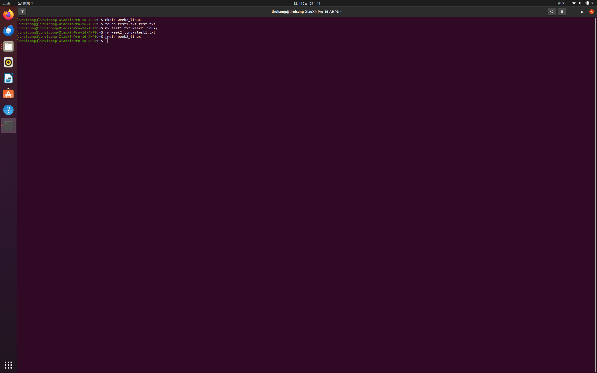
2. 截图：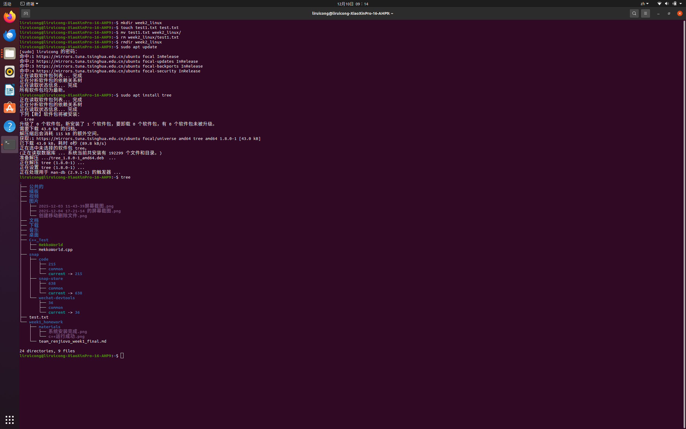
3. 截图：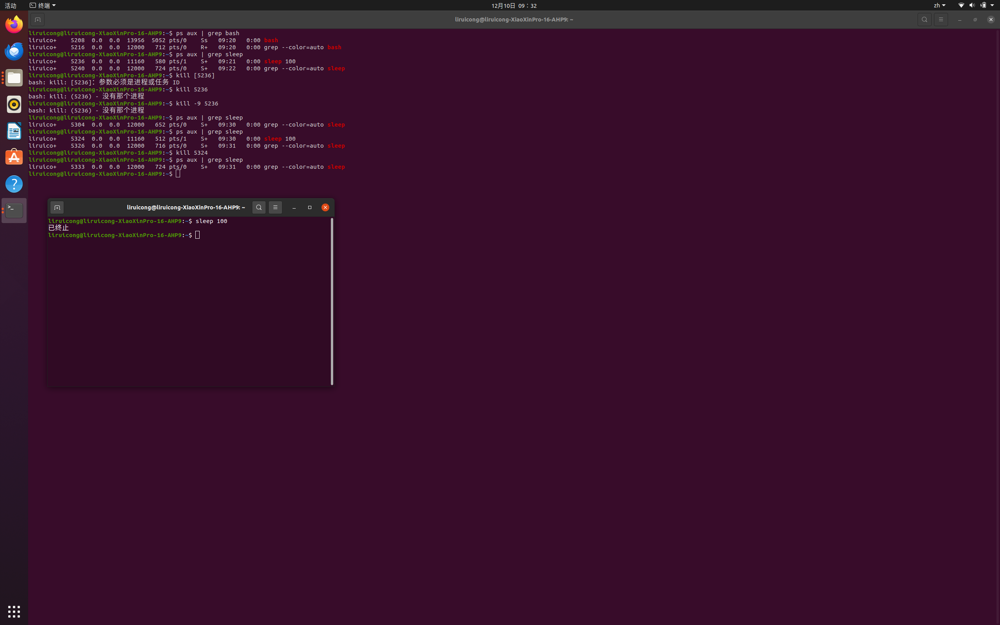
### 2.2 Python与C++编程练习
1. 用vscode打开，写入代码，终端运行 截图：
2. 终端打开vscode,写入代码(输入两个数字求和)
3. 用vsscode打开创建launch.json 启动调试，设置断点 截图：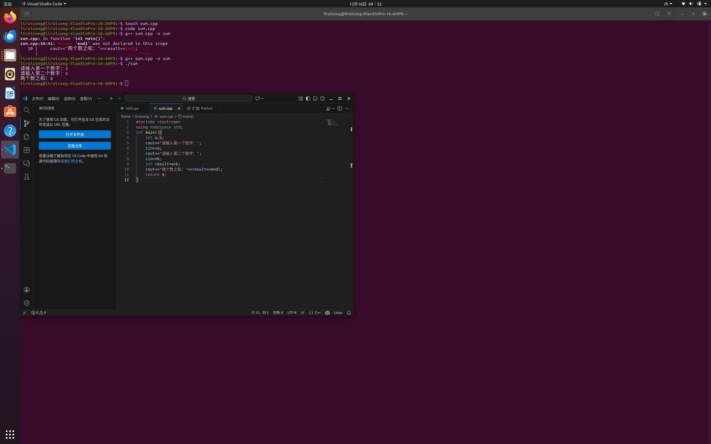
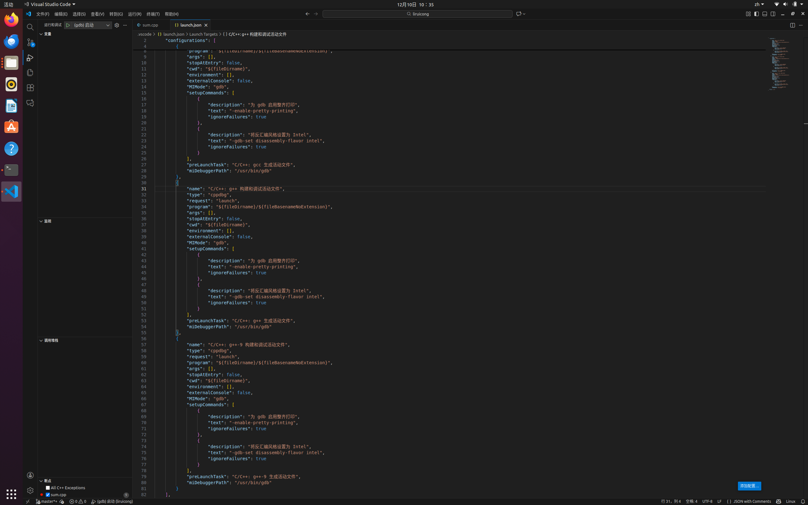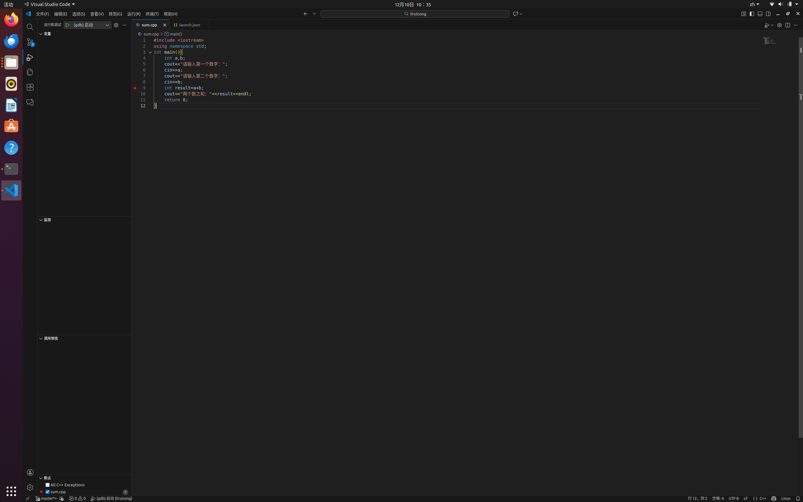
### 2.3 ROS1安装验证
1. roscore启动 
2. rosnode list
3. ROS环境变量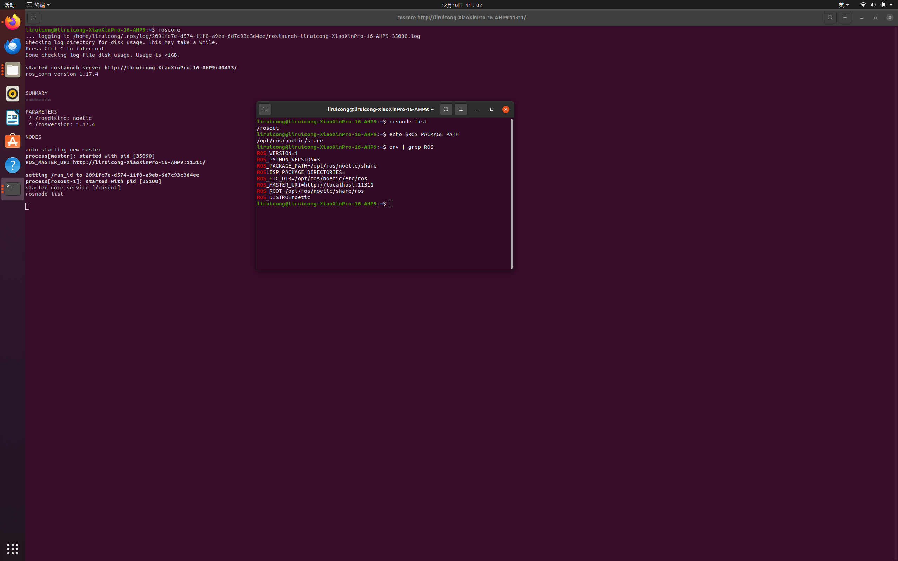 
### 2.4 CATKIN工作空间与功能包
1. catkin_ws创建与编译 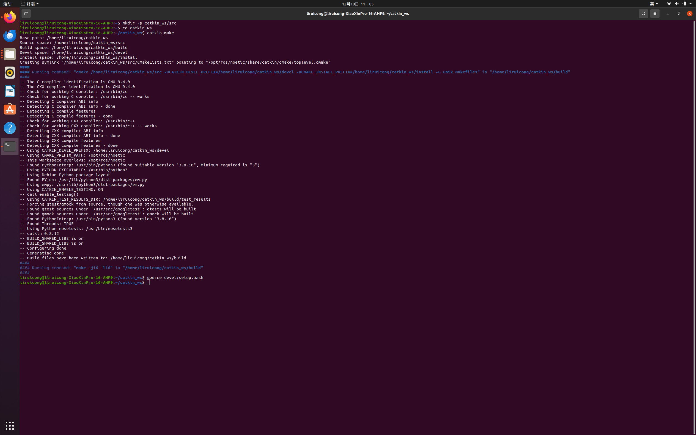
2. beginner_tutorials功能包 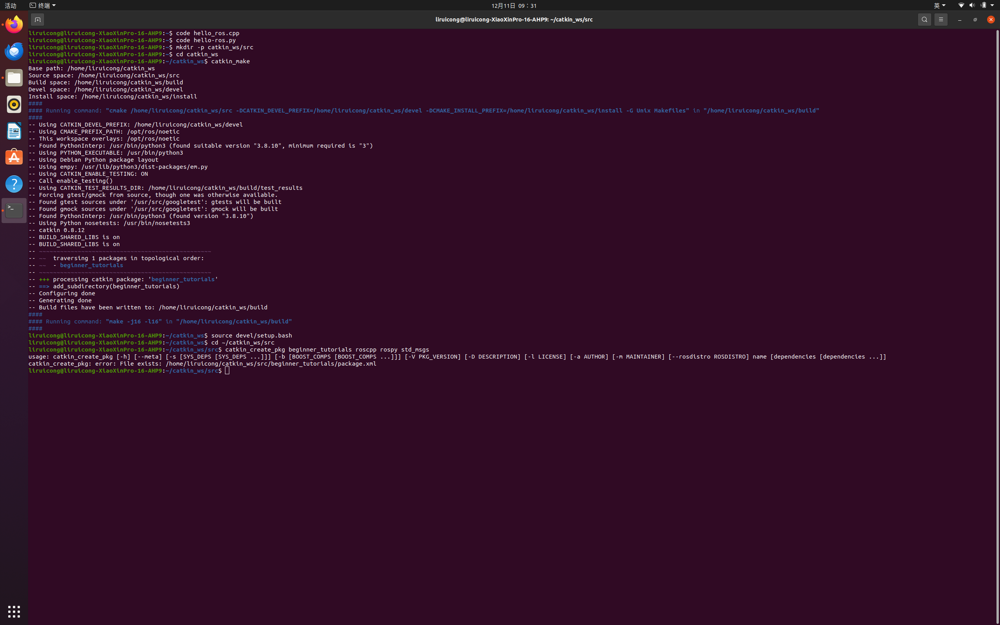
3. HelloWorld节点运行 进入src目录输入python代码添加执行权限
### 2.5 Turtlesim小乌龟基础
1. 打开多个终端分别输入代码启动ros运行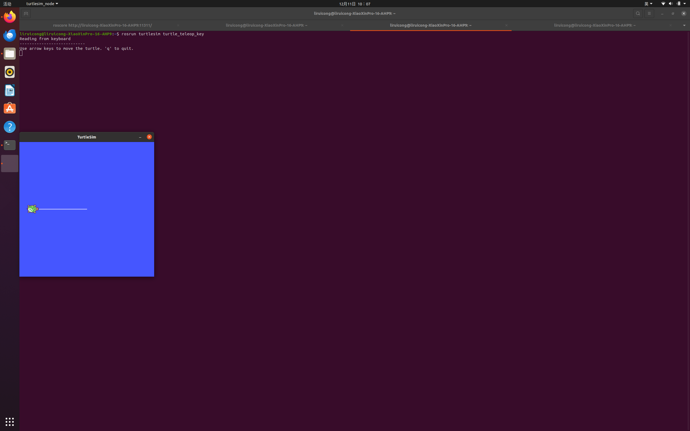
2. 保持上一个终端运行，输入代码控制小乌龟 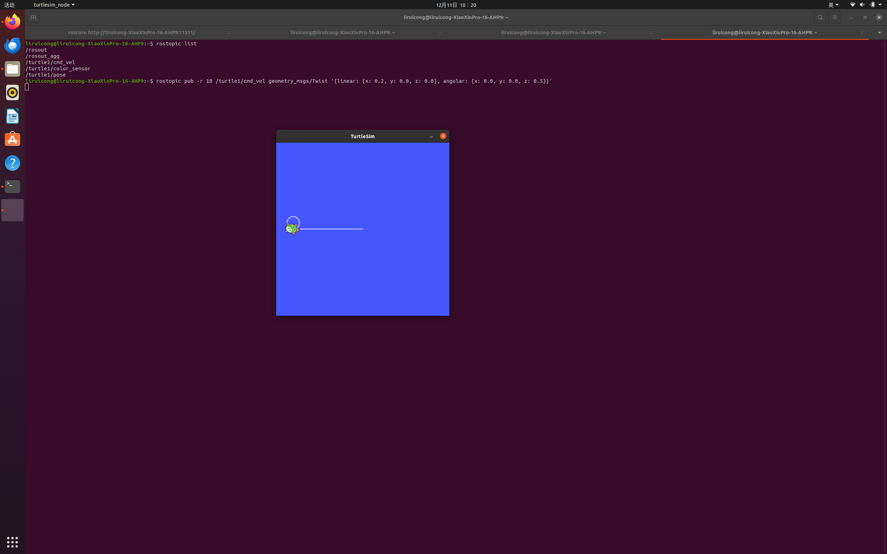
3. python程序控制小乌龟 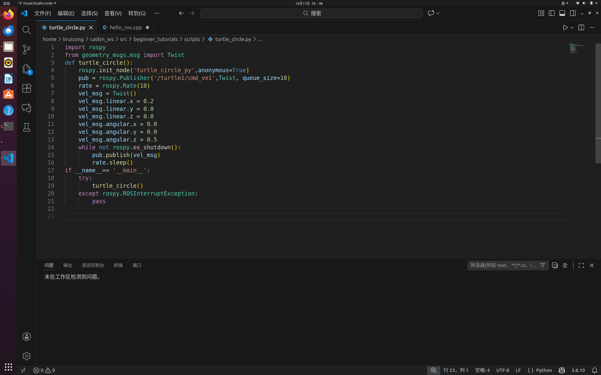
### 2.6 多乌龟launch+rqt_graph
1. 创建launch文件 在beginner_tutorials目录下创建 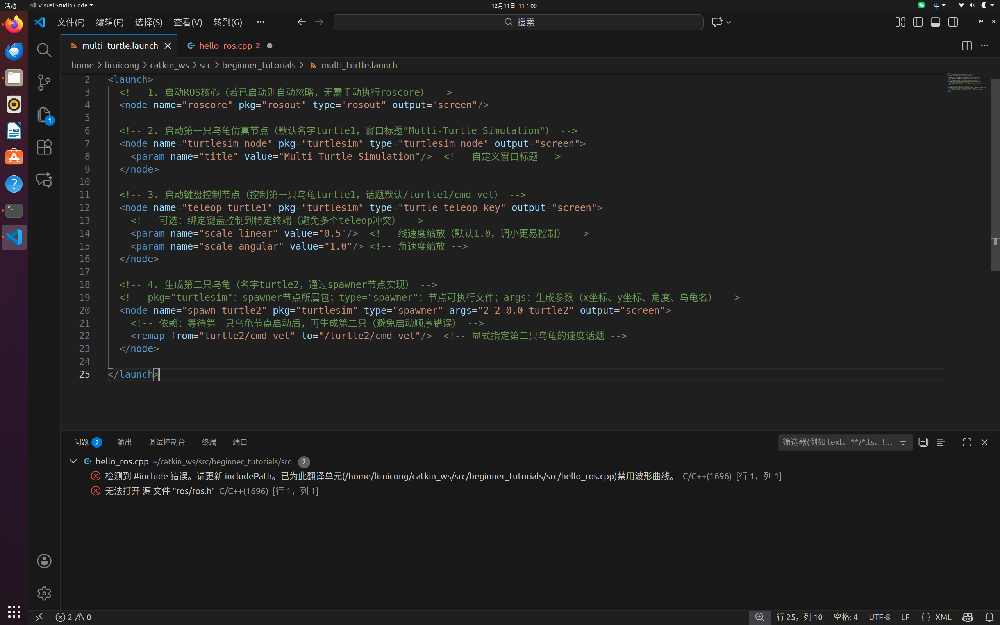
2. 后面的不会弄了
## 3.遇到的问题与解决方法
遇到不会写的代码和生成不了两只乌龟，运用豆包方法解决